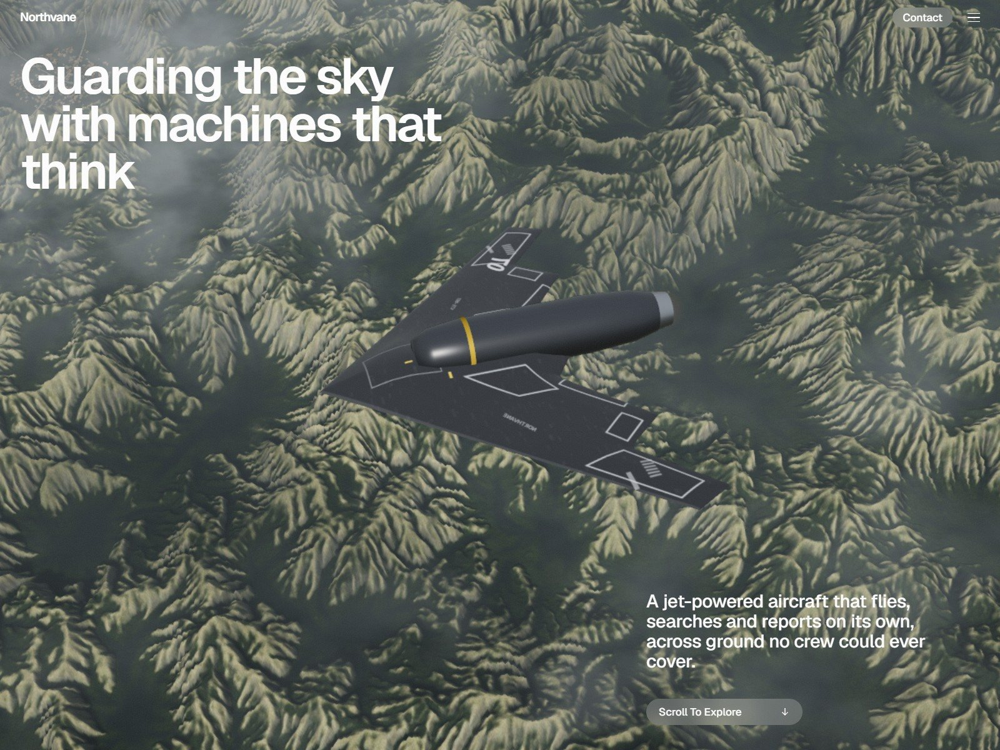
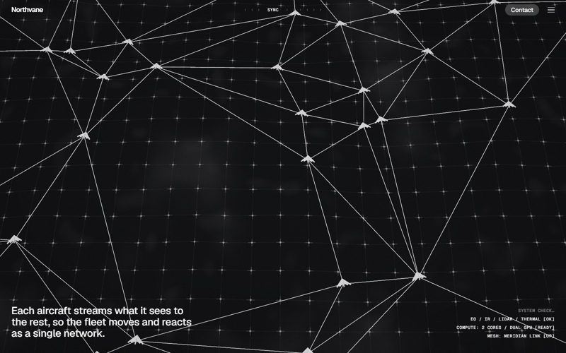
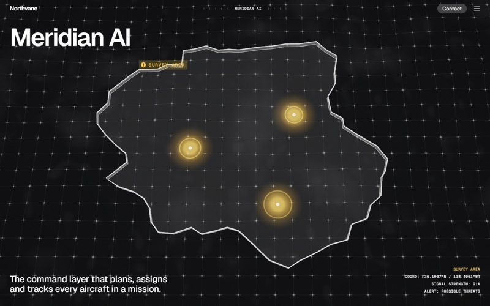
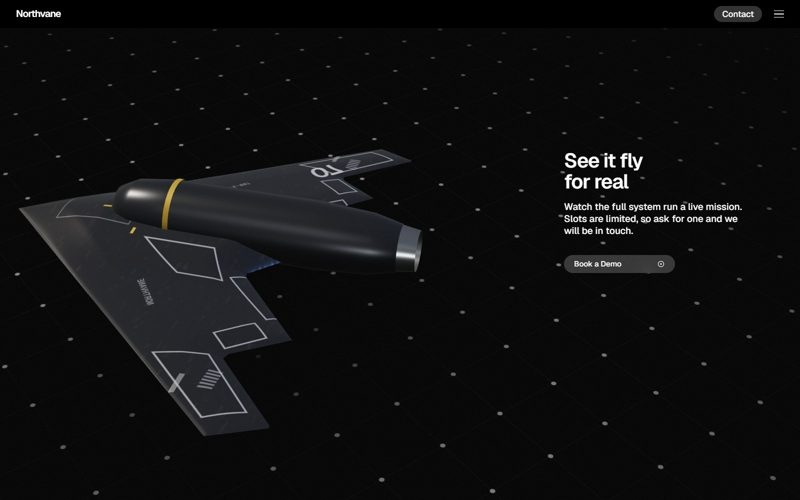

# Northvane

A scroll-driven 3D product story, built with three.js and no 3D models, photos or video. The terrain, the aircraft, the tactical map, the swarm network, the globe and even the card images are all generated in code.

**Live:** https://northvane-aero.vercel.app (best on a laptop: scroll slowly, move your mouse)



| Swarm mesh network | Tactical map | Studio close-up |
|---|---|---|
|  |  |  |

Northvane is a fictional autonomous-aircraft company. The page tells one mission in 15 scenes. The aircraft is introduced, joined by its fleet and linked into a mesh network. It detects objects, finds a heat signature and confirms a fire. Then a command layer coordinates the response on a tactical map, and the page ends on use cases, a coverage globe, a demo call-to-action and a footer where the aircraft lands.

## Run it locally

```bash
npm install
npm run dev
```

Then open http://localhost:5194. The page needs HTTP (not `file://`) because it loads ES modules and fetches the terrain data. `npm run build` writes a static `dist/` for hosting.

Debug URL parameters:

| Param | Effect |
|---|---|
| `?stop=N` | Skip the loader and jump to scene rest point `N` (0–14) |
| `?t=VH` | Jump to an exact scroll position, in viewport-heights |
| `?view=auto&p=0.5` | Render one tail view (`globe`, `auto`, `land`) full screen at progress `p` |
| `?bake=wildfire\|border\|grid` | Render a use-case card image from the 3D scene |

## How it works

**Scroll model.** The page is 67 viewport-heights long, split into 15 scenes (100 / 500 / 100 vh). One wheel, touch or arrow-key gesture plays the page at a steady speed to the next scene's resting point, about 2 seconds per scene, and scrolling is locked while it plays. This is Lenis `virtualScroll` plus a linear `scrollTo`. Past the last scene it becomes a normal smooth-scrolling page. The 3D world never reads the scroll position directly: it follows a critically damped copy (`state.vs`), so the camera, aircraft, map colours and pinned labels all ease together.

**Two worlds, one canvas.**
- **World A** is the terrain flight.
- **World B** is the tactical map.

Both render to half-float render targets and are composited with a diagonal wipe. Camera and aircraft poses are keyframed per scene stop and interpolated with sine easing.

**Terrain.** `tools/gen_terrain.py` (numpy + Pillow, about 2 minutes) bakes `assets/terrain/`:
- a 1024² ridged, domain-warped heightfield carved by about 650,000 vectorised hydraulic-erosion droplets;
- a 2048² satellite-style colour map (forest, dry crests, rock, rivers, lakes, a town patch);
- a baked sun-shadow and ambient-occlusion map.

At runtime the terrain is loaded at half scale and mirror-tiled 5×5, with low-res outer tiles, so wide shots never reach an edge. Change the seed and re-run the script for a new landscape.

**Aircraft.** The flying wing is a lofted grid mesh built from the planform outline, with an airfoil-like thickness profile (thick centre body, thin rounded edges). It has a turned (lathe) engine nacelle, and the panel lines and markings are drawn onto a canvas texture at runtime. The footer uses a version with landing legs, posed as a tail-sitter.

**Tactical map.**
- A grid shader on displaced ground.
- Region outlines are ribbon meshes that draw in via an arc-length uniform.
- Pulse markers are additive shader quads.
- Patrol icons fly loops that leave fading vertex-colour trails.
- The swarm network is a Bowyer–Watson Delaunay triangulation, recomputed 8×/s.

**HTML pinned to 3D.** The spec callouts, drone tags, detection boxes, region chips and agency callouts are plain DOM, projected from 3D anchor points every frame.

**Performance.**
- Programs are precompiled with `renderer.compileAsync`.
- Tail views are built lazily.
- Render resolution adapts between 0.75× and 1.5× DPR based on measured frame time.
- The terrain's detail is pre-baked, so the fragment shader stays cheap.

## Project layout

```
package.json          npm run dev / npm run build
vite.config.js        dev server on port 5194, copies assets into dist
index.html            shell, preloads
css/style.css         design tokens, type scale, layout, responsive rules
js/content.js         every string on the page (rebrand here)
js/main.js            loader, scroll stepping, scene reveals, pinned labels, menu, contact modal, audio
js/world.js           terrain + map worlds, keyframes, wipe compositor, tail views, loader drone
js/vendor/            three.js r169, Lenis 1.1.20
assets/terrain/       baked terrain (height.bin, albedo.jpg, light.jpg, meta.json)
assets/case-*.jpg     use-case images rendered from the scene (?bake=)
tools/gen_terrain.py  offline terrain generator
```

## Credits

This is a design-engineering study. The page structure, scroll pacing and interaction model are modelled on [usavionix.com](https://www.usavionix.com/), a site worth visiting. Northvane, its copy, and every 3D asset and image in this repo are original. This project is not affiliated with USAvionix. The founders' logos are fictional wordmarks, and the contact form is a demo that sends nothing.

Type is [Geist and Geist Mono](https://vercel.com/font) (SIL OFL), loaded from Google Fonts. Bundled libraries: see [THIRD_PARTY_NOTICES.md](THIRD_PARTY_NOTICES.md).

## License

[MIT](LICENSE)
